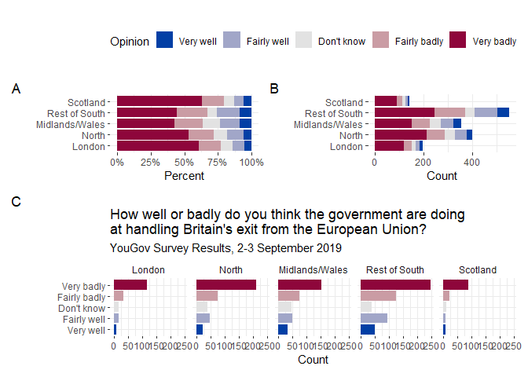

================
Thao Tran

``` r
library(tidyverse)
library(sf)
```

    ## Warning: package 'sf' was built under R version 4.1.3

``` r
library(ggmap)
```

    ## Warning: package 'ggmap' was built under R version 4.1.3

``` r
library(geofacet)
```

    ## Warning: package 'geofacet' was built under R version 4.1.3

``` r
library(rnaturalearth)
```

    ## Warning: package 'rnaturalearth' was built under R version 4.1.3

``` r
library(lubridate)
# devtools::install_github("UrbanInstitute/urbnmapr")
library(urbnmapr)
library(colorspace)
#animation
library(gganimate)
```

    ## Warning: package 'gganimate' was built under R version 4.1.3

``` r
library(scales)
# text data
library(tidytext)
```

    ## Warning: package 'tidytext' was built under R version 4.1.3

``` r
library(ggtext)
```

    ## Warning: package 'ggtext' was built under R version 4.1.3

``` r
library(glue)
library(ggwordcloud)
```

    ## Warning: package 'ggwordcloud' was built under R version 4.1.3

``` r
library(ggraph)
```

    ## Warning: package 'ggraph' was built under R version 4.1.3

``` r
library(igraph)
```

    ## Warning: package 'igraph' was built under R version 4.1.3

``` r
# layout
library(patchwork)
```

    ## Warning: package 'patchwork' was built under R version 4.1.3

1.  **Adopt, don’t shop.**

``` r
# load data 
dog_travel = read.csv("data/dog_travel.csv") %>%
  # only keeps unique observation by description. id is not used to identify uniqueness given instances of the same description can have different ids 
  distinct(description,.keep_all = TRUE)

# Calculate the number of dogs available to adopt per contact_state
dog_state = dog_travel %>% group_by(contact_state) %>% count()

# histogram on number of dogs avail to adopt 
dog_state %>% ggplot(aes(x = n)) +
  geom_histogram(fill = "maroon",bins=10)+
  labs(
    title = "Histogram of the number of dogs available to adopt per contact state",
    y = "Frequency",
    x = "Numbers of dogs available to adopt per contact state"
  )+
  theme_bw()
```

<!-- --> Describe the
distribution of this variable:

The number of dogs available to adopt per contact state is skewed to the
right with peaks around 75 dogs.

``` r
#load state sf
states_sf <- get_urbn_map("states", sf = TRUE)

#join data and map
states_sf %>% left_join(dog_state,by = c("state_abbv" = "contact_state")) %>%
  ggplot() +
  geom_sf(mapping = aes(fill = n))+
  theme_bw()+
  scale_fill_continuous_sequential(palette = "mako",trans="log10")+
  labs(
    title = "Choropleths of the number of dogs available to adopt per contact state",
    fill= "Number of Dogs"
  )
```

    ## old-style crs object detected; please recreate object with a recent sf::st_crs()

<!-- -->

Interpret the visualization:

The map show several of geographical cluster with high concentration of
dogs to adopt particularly the northeast region. Some states also stands
out such as Minnesota and Washington for having large number og dogs to
adopt compared to neighboring states. On the contrary, Texas stands out
for having lowest number of dogs to adopt.

2.  **Country populations**

``` r
#load data 
country = read.csv("data/country-pop.csv")

#top 10 highest population count in 2020
top10 = country %>% filter(date == 2020) %>% top_n(n = 10, wt = SP.POP.TOTL) %>% arrange(desc(SP.POP.TOTL))

#racing bar chart for the change in population for these countries
country %>% 
  filter(country %in% top10$country) %>%
  ggplot(aes(y = reorder(country,SP.POP.TOTL), x = SP.POP.TOTL,fill= country)) +
  geom_col()+
  labs(
    title = "Population of Top 10 Most Populated Countries in the Past 50 Years",
    y = "Country",
    x = "Total Population"
  )+
  transition_reveal(date)+
  scale_fill_viridis_d()+
  scale_x_continuous(labels = label_number(suffix = " M", scale = 1e-6))+
  theme(legend.position = "none") 
```

<!-- -->

3.  **Battle of the newspapers**

``` r
#load data
chi = read.csv("data/chicago_sun_times_2019.csv")
bal = read.csv("data/baltimore_sun_2019.csv")

#get stop words
stop_words = get_stopwords("en") %>%
  add_row(word = c("â","s"),lexicon = rep("manual",2))

#Omitting stop words, find the 20 most common words in headlines, save as two separate objects
chi_top20 = chi %>% unnest_tokens(output = word, input = title,token = "words") %>%
   anti_join(stop_words) %>%
   count(word,sort=TRUE) %>% top_n(20,n)
```

    ## Joining, by = "word"

``` r
bal_top20 = bal %>% unnest_tokens(output = word, input = title,token = "words") %>%
   anti_join(stop_words) %>%
   count(word,sort=TRUE) %>% top_n(20,n)
```

    ## Joining, by = "word"

``` r
#print 
print(chi_top20)
```

    ##        word    n
    ## 1       man 2451
    ## 2   chicago 1964
    ## 3    police 1818
    ## 4     bears 1230
    ## 5      park 1185
    ## 6      shot  903
    ## 7    killed  823
    ## 8   charged  812
    ## 9     woman  808
    ## 10 shooting  784
    ## 11        2  755
    ## 12    white  753
    ## 13     cubs  713
    ## 14     2019  691
    ## 15      new  650
    ## 16      sox  631
    ## 17     side  587
    ## 18  missing  585
    ## 19  wounded  540
    ## 20    south  516

``` r
print(bal_top20)
```

    ##          word   n
    ## 1   baltimore 821
    ## 2        city 323
    ## 3      police 312
    ## 4         new 293
    ## 5      county 242
    ## 6        news 218
    ## 7      school 203
    ## 8    maryland 187
    ## 9         man 178
    ## 10      state 167
    ## 11   services 153
    ## 12     former 146
    ## 13       says 137
    ## 14      trump 137
    ## 15       year 122
    ## 16     around 116
    ## 17         md 113
    ## 18       plan 111
    ## 19 horoscopes 110
    ## 20     center 108

Provide an interpretation for how the common words across the two
newspaper headlines are similar or different in terms of focus:

Comparing the two lists of common words between Chicago an Baltimore, we
the only common thing is that they both has their corresponding city
name in their top 20 words. However, the topic of these two lists are
quite different. In the Chicago list of common words, there are many
words referring to violence and crime such as “shot”, “killed”,
“missing”, and “wounded”. The second apparent theme for the Chicago list
is sports with words like “bears”, “cubs”, and “sox”. On the other hand,
the common words for Baltimore are more related to policy or politics
such as “trump”, “school” and “services”.

``` r
# bar plot for chicago
chi_bar = chi_top20 %>% ggplot(aes(y = reorder(word,n), x = n)) +
  geom_col(fill = "maroon")+
  theme_bw()+
  labs(
    title = "Top 20 most common words",
    subtitle="from the headlines of The Chicago Sun-Times",
    y = "Word",
    x = "Word count"
  )

# bar plot for baltimore
bal_bar = bal_top20 %>% ggplot(aes(y = reorder(word,n), x = n)) +
  geom_col(fill = "yellow4")+
  theme_bw()+
  labs(
    title = "Top 20 most common words",
    subtitle = "from the headlines of The Baltimore Sun",
    y = "Word",
    x = "Word count"
  )

# combine two bar plot using patchwork
chi_bar+bal_bar
```

<!-- -->

``` r
#rbind data to prepare for barplots 
data.frame(rbind(chi_top20,bal_top20)) %>%
  mutate(news = rep(c("The Chicago Sun-Times","The Baltimore Sun"),each=20)) %>% 
  group_by(news) %>% 
  mutate(rank = rank(n))%>%
  #barplots
  ggplot(aes(y = reorder(word,rank),x = n,fill = news))+
  geom_col()+
  facet_wrap(~news,scales = "free_y")+
  theme_bw()+
  scale_fill_manual(values = c("yellow4","maroon"))+
  labs(
    title = "Top 20 most common words from newspapers headlines",
    y = "Word",
    x = "Word count"
  )+theme(legend.position = "none")
```

<!-- -->

4.  **Brexit**

``` r
# load data
brexit = read.csv("data/brexit.csv")

# reorder factor levels for opinion
brexit$opinion = factor(brexit$opinion,
                        levels=c(
                          "Very well",
                          "Fairly well",
                          "Don't know",
                          "Fairly badly",
                          "Very badly"
                          ))
# rename region 
brexit$region = factor(brexit$region, levels=c(
  "london","north","midlands_wales","rest_of_south","scot"),
labels = 
  c("London","North","Midlands/Wales","Rest of South","Scotland")
)

#plot A 
plota = brexit %>% ggplot(aes(y = region, fill = opinion))+
  geom_bar(position = "fill")+
  labs(
    y = "",
    x="Percent",
    fill="Opinion"
  )+
  scale_fill_discrete_diverging("Blue-Red")+
  scale_x_continuous(labels = scales::percent)+
  theme_bw()+
  theme(
    panel.border = element_blank(),
    legend.position = "top"
  )

#plot b 
plotb = brexit %>% ggplot(aes(y = region, fill = opinion))+
  geom_bar()+
  labs(
    y = "",
    x="Count",
    fill="Opinion"
  )+
  scale_fill_discrete_diverging("Blue-Red")+
  theme_bw()+
  theme(
    panel.border = element_blank(),
    legend.position = "top"
  )

#plot c
plotc = brexit %>% ggplot(aes(y = opinion, fill = opinion))+
  geom_bar()+
  labs(
    title="How well or badly do you think the government are doing \nat handling Britain's exit from the European Union?",
    subtitle="YouGov Survey Results, 2-3 September 2019",
    y = "",
    x="Count",
    fill="Opinion"
  )+
  facet_wrap(~region,ncol=5)+
  scale_fill_discrete_diverging("Blue-Red")+
  theme_bw()+
  theme(
    panel.border = element_blank(),
    strip.background = element_blank(),
    legend.position = "top"
  )

#combine plot using patchwork
guide_area()/(plota|plotb)/plotc +
  plot_layout(guides = "collect")+
  plot_annotation(tag_levels = 'A')
```

<!-- -->
